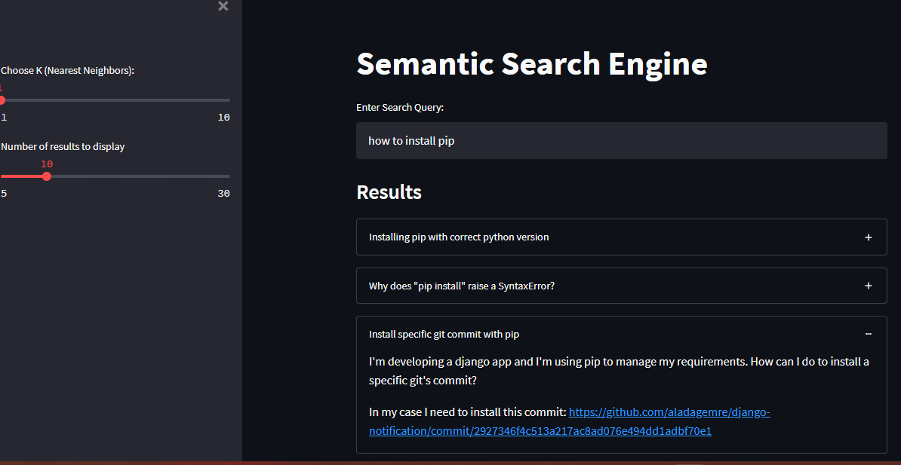

# Semantic-Search-Engine-Using-ElasticSearch
A semantic search engine to find questions semantically similar to given query.

Pipeline Steps
* Pull train data from Upstream(S3)
* Train or use a pretrained USE/BERT model to generate vector embeddings of text
* Load data along with their vector embeddings to ElasticSearch (AWS OpenSearch)
* Build a dashboard (streamlit) that accepts user query and passes it to AWS API Gateway
* API Gateway processes parameters(query, number of results to display,  k (nearest neighbors)) and triggers AWS Lambda Function
* AWS Lambda Function loads model from Tensorflow Hub, generates vector embedding of text parameter and queries ElasticSearch
* ElasticSearch returns results back to AWSLambda which returns response back to Streamlit client.
* Results are displayed in UI

